# Scandi Haven — PAD §2–§3 (Production-Locked)

> **Scope:** §2 High-Level System Topology · §3 Application Architecture (Layer Model · Directory Structure · Critical Code Patterns)
> **Companion:** `PRD.md` v4.0 · `PAD.md` §1 (Stack + ADRs v1.0 2026-09-10)
> **Classification:** INTERNAL — DEFINITIVE AS-BUILT. Where code and prose disagree, code at the cited file:line is truth; file an ADR.

---

## 2. High-Level System Topology

### 2.1 End-to-End Flow (Browser → Edge → Proxy → App → Domain → Data → External Services)

```mermaid
flowchart TB
    %% ── Clients ──
    BrowserStorefront["Browser — Storefront :3000<br/>RSC page shell + Client Islands<br/>cart-drawer · gallery · buy-panel · quantity-stepper<br/><i>Runtime: Browser JS (React 19). Scaling: stateless CDN cache. Constraint: no card data — iframe only.</i>"]:::client
    BrowserAdmin["Browser — Admin :3001<br/>RBAC-gated (staff) layout<br/>products / orders / customers<br/><i>Runtime: Browser JS. Scaling: per-staff session. Constraint: gate is UX only — re-auth in Actions.</i>"]:::client

    %% ── Edge ──
    Edge["Edge / CDN — Cloudflare<br/>TLS + cache + Insights beacon injection<br/>allow-listed: static.cloudflareinsights.com<br/><i>Runtime: Cloudflare Edge. Scaling: global PoPs. Constraint: CSP must allow beacon or every pageview violates.</i>"]:::edge
    Beacon["Cloudflare Insights RUM beacon<br/>https://static.cloudflareinsights.com/beacon.min.js<br/>injected at edge — not in bundle"]:::edge

    %% ── Proxy (Node) ──
    Proxy["Vercel Node — proxy.ts<br/>securityHeaders() + x-request-id + origin trust<br/>x-forwarded-host / host / x-forwarded-proto<br/>rewrites: /admin → /  (admin app)<br/><i>Runtime: Node.js 22 (proxy). Scaling: stateless, per-request. Constraint: MUST live at apps/*/src/proxy.ts; config.matcher inline literal.</i>"]:::proxy

    %% ── Next.js Apps ──
    WebApp["Next.js 16 App — apps/web :3000<br/>RSC queries: commerce/catalog, cart-service#getCartDto<br/>Mutations: Server Actions apps/web/src/actions/* → ActionResult&lt;T&gt;<br/>Route Handlers: /api/webhooks/stripe, /api/auth/[...all], /api/search/typeahead (60/min/IP), /api/health, /api/jobs/run<br/><i>Runtime: Node.js 22 (App Router, Turbopack). Scaling: stateless web tier; sessions in DB. Constraint: pages async, params/cookies awaited; exports only default/metadata/generateMetadata/revalidate/dynamic.</i>"]:::app
    AdminApp["Next.js 16 App — apps/admin :3001<br/>RSC + (staff) layout gate<br/>Mutations: apps/admin/src/actions/* → requirePermission() → audit_log<br/><i>Runtime: Node.js 22. Scaling: stateless. Constraint: gate does not authorize — Actions re-check RBAC matrix.</i>"]:::app

    %% ── Domain Packages ──
    Commerce["packages/commerce — Pure Domain<br/>pricing.ts / promotions.ts / money.ts / order-state.ts<br/>cart-service.ts / checkout-service.ts / jobs.ts<br/>providers/* (Search / Tax / Shipping / Email / JobRunner)<br/>rate-limit.ts / request-dedupe.ts / rich-text.ts / result.ts<br/><i>Runtime: Node (imported via transpilePackages). Scaling: pure functions — horizontally free. Constraint: money integers (minor units) + transition() only writer; vendor SDKs confined to adapters; no package build step.</i>"]:::domain
    AuthPkg["packages/auth — Better-Auth + RBAC<br/>server.ts (Drizzle adapter, admin plugin) / client.ts<br/>rbac.ts matrix + trusted-origins.ts<br/><i>Runtime: Node. Scaling: DB sessions (revocation immediate). Constraint: origin derived from proxy-controlled headers only — never Origin/Referer (H-AUTH).</i>"]:::domain

    %% ── Data ──
    DbPkg["packages/db — Pooled Drizzle<br/>globalThis singleton Pool (max 10) + Drizzle proxy<br/>ensureSeeded() advisory-lock + natural-key upserts<br/>schema: catalog / orders / customers / content / ops / auth / enums<br/><i>Runtime: Node (pg 8.23 + drizzle-orm 0.45). Scaling: pooled (globalThis — never per-import). Constraint: seed/migrate refuse non-local DATABASE_URL; HMR shares one pool (audit C1).</i>"]:::data
    PG["PostgreSQL 17 — multi-AZ<br/>postgres:17-alpine · scandihaven_postgres<br/>postgres_data (PGDATA=/var/lib/postgresql/data/pgdata)<br/>pgcrypto (gen_random_uuid) + pg_trgm (ILIKE typo)<br/>PITR: RTO 4h / RPO 15m (PRD §11.4)<br/><i>Runtime: PG 17-alpine. Scaling: single writer, read-replicas out-of-scope v1. Constraint: advisory locks serialize order_number + ensureSeeded.</i>"]:::data
    ObjectStore["Object Storage — Private Bucket<br/>product/media assets (presigned URLs)<br/><i>Runtime: S3-compatible. Scaling: CDN-cached. Constraint: bucket private; URLs signed server-side (never public).</i>"]:::data

    %% ── External Services ──
    StripeJS["Stripe.js + Payment Element (SAQ-A)<br/>js.stripe.com iframe · confirmPayment() on useStripe()<br/>Stripe Tax via TaxProvider port<br/><i>Runtime: Stripe-hosted iframe. Constraint: card data never touches our servers; publishable key only in browser.</i>"]:::ext
    StripeAPI["Stripe API — PaymentIntents + Webhooks<br/>signature window 300s · idempotencyKey cart:cartId:total<br/><i>Runtime: api.stripe.com. Scaling: Stripe-managed. Constraint: amount re-verified server-side (FR-508).</i>"]:::ext
    WebhookHandler["/api/webhooks/stripe — Route Handler<br/>verify signature → tx { webhook_event UNIQUE → re-price → FOR UPDATE inventory → order+payment → outbox jobs }<br/><i>Runtime: Node (Route Handler). Constraint: webhook_event insert INSIDE TX (audit H4d); duplicate → 200 no-op.</i>"]:::ext

    ResendSvc["Resend — Email Delivery<br/>packages/email (Resend adapter)<br/>templates as React → renderToStaticMarkup at runtime<br/><i>Runtime: Resend API. Scaling: provider-managed. Constraint: react-dom/server via turbopackIgnore runtime import; log transport when RESEND_API_KEY absent.</i>"]:::ext
    EmailPkg["packages/email<br/>send.ts (turbopackIgnore) + templates/order-confirmation.tsx<br/><i>Constraint: never statically import react-dom/server in App Router graph.</i>"]:::domain
    JobRunner["Outbox — job table + /api/jobs/run<br/>CRON_SECRET gated · idempotencyKey per job<br/>email.order_confirmation · ops.payment_orphan<br/><i>Runtime: Node (Route Handler). Scaling: at-least-once drain. Constraint: outbox jobs inserted in placement TX.</i>"]:::data

    %% ── Flows ──
    BrowserStorefront --> Edge
    BrowserAdmin --> Edge
    Edge --> Proxy
    Beacon -. "injected at edge<br/>CSP allow-listed" .-> Edge
    Proxy --> WebApp
    Proxy --> AdminApp

    WebApp --> Commerce
    AdminApp --> Commerce
    WebApp --> AuthPkg
    AdminApp --> AuthPkg
    Commerce --> DbPkg
    AuthPkg --> DbPkg
    DbPkg --> PG
    PG --> ObjectStore

    WebApp -. "Payment Element iframe" .-> StripeJS
    StripeJS -. "tokenized" .-> StripeAPI
    StripeAPI -- "payment_intent.succeeded<br/>Stripe-Signature (300s)" --> WebhookHandler
    WebhookHandler --> Commerce
    Commerce --> JobRunner
    JobRunner --> EmailPkg
    EmailPkg --> ResendSvc
    Commerce -. "TaxProvider + ShippingRateProvider" .-> StripeAPI

    %% ── Health / Cron ──
    WebApp -. "/api/health → {status, db}" .-> PG
    AdminApp -. "/api/health" .-> PG

    classDef client fill:#fff7ed,stroke:#c97b5e,stroke-width:1.5px,color:#1f1b17
    classDef edge fill:#f0f9ff,stroke:#0ea5e9,stroke-width:1.5px,color:#0c4a6e
    classDef proxy fill:#fefce8,stroke:#ca8a04,stroke-width:1.5px,color:#422006
    classDef app fill:#faf7f2,stroke:#8f4326,stroke-width:1.5px,color:#1f1b17
    classDef domain fill:#f0fdf4,stroke:#16a34a,stroke-width:1.5px,color:#052e16
    classDef data fill:#e8e0d2,stroke:#8f4326,stroke-width:1.5px,color:#1f1b17
    classDef ext fill:#f5f3ff,stroke:#7c3aed,stroke-width:1.5px,color:#2e1065
```



### 2.2 Layer Annotations (Runtime · Scaling · Constraints)

| Layer | Runtime | Location | Scaling | Constraints & Invariants |
|---|---|---|---|---|
| **Browser — Storefront** | React 19 Client Islands in RSC shell | `apps/web/src/components/*` (`cart-drawer.tsx`, `product-buy-panel.tsx`, `gallery`) + `apps/web/src/stores/cart-store.ts` | Stateless; CDN-cached HTML, islands hydrate per page | Islands hold **drawer/UI only** — no server data cached client-side. Props from RSC are truth; `useOptimistic` + rollback. Card data confined to Stripe iframe (SAQ-A). |
| **Browser — Admin** | React 19 Client | `apps/admin/src/app/(staff)/*` + `apps/admin/src/lib/admin-guard.ts` | Per-staff DB session | `(staff)` layout gate is **UX redirect only** — every mutation calls `requirePermission()` (`packages/auth/src/rbac.ts`) and writes `audit_log`. No inline role checks. |
| **Edge / CDN** | Cloudflare (TLS + cache) | Edge — outside repo | Global PoPs; cache `/_next/static` aggressively | Injects `static.cloudflareinsights.com` RUM beacon. CSP **must** allow `script-src … https://static.cloudflareinsights.com` + `connect-src … https://cloudflareinsights.com` (`packages/config/src/security-headers.ts:securityHeaders()` — E2E-7 fix). Blocking the beacon logs a violation on every production pageview. |
| **Vercel Node — Proxy** | Node.js 22 (`proxy.ts`) | `apps/web/src/proxy.ts:proxy()` · `apps/admin/src/proxy.ts:proxy()` · `packages/config/src/security-headers.ts:securityHeaders()` | Stateless, per-request, horizontally infinite | **MUST** live at `apps/*/src/proxy.ts` — Next 16.3 discovers only there; repo-root placement compiles but never registers (audit H8d). `config.matcher` is an **inline literal** — Next statically parses it; import indirection silently disables matching. Sets `x-request-id` (`crypto.randomUUID()`), `securityHeaders()` on **every** response including `/sign-in` (audit H5d/LD-2: credential page must not go bare), derives origin trust via `requestOriginFromHeaders()` (`packages/auth/src/trusted-origins.ts`) from `x-forwarded-host`/`host`/`x-forwarded-proto` only. Rewrites: admin `beforeFiles` strips `/admin` prefix after gate (`apps/admin/next.config.ts:rewrites()` — H2-ADMIN). CSP `unsafe-inline` remains until Phase 1 nonce CSP; remainder restrictive. |
| **Next.js Apps** | Node.js 22, App Router + Turbopack | `apps/web/src/app/*` · `apps/admin/src/app/*` · `apps/*/src/instrumentation.ts` | Stateless web tier — any replica serves any request; sessions live in DB, not memory | RSC: pages are `async` — `params`/`searchParams`/`cookies()`/`headers()` are **awaited** (Next 16.3). Page modules export **only** `default`, `metadata`/`generateMetadata`, `revalidate`, `dynamic` — extra exports fail `next build`. Mutations: **Server Actions only** (`apps/*/src/actions/*` → `ActionResult<T>` `packages/commerce/src/result.ts` — `ok`/`fail` with `ErrorCode`, never throw across boundary). Reads: RSC calls `@scandihaven/commerce/*` queries directly against Drizzle. Route Handlers exist **only** for Stripe webhooks, Better-Auth, typeahead, jobs runner, health — no REST for UI mutations. `instrumentation.ts` runs `parseServerEnv()` + `parseFlags()` at boot — missing env or unknown `FEATURE_*` fails fast (PRD §9.4). `DISABLE_IMAGE_OPTIMIZER=1` local/E2E only; production keeps `sharp`. |
| **Domain — commerce + auth** | Node, imported via `transpilePackages` | `packages/commerce/src/*` · `packages/auth/src/*` | Pure functions → horizontally free; no per-request state | **No package build step** — `exports` → `src/*.ts`, apps compile via `transpilePackages` (`apps/*/next.config.ts` — ADR-007, NFR-STACK-6). Dependency direction enforced: `db ← auth ← commerce ← apps`; `ui` has no commerce import (use structural props). **Money is integers** (`packages/commerce/src/money.ts:assertMinor`, `sumMinor`, `roundHalfUp`) — floats never touch money; discount distribution uses **BigInt largest-remainder** (`packages/commerce/src/pricing.ts:distributeDiscount` — property-tested). **Order status** changes only via `transition()` (`packages/commerce/src/order-state.ts:transition()` → `InvalidOrderTransition`). Provider ports (`packages/commerce/src/providers.ts` / `search-provider.ts`): vendor SDKs stay in adapters; new vendors implement the port. `rate-limit.ts` is Postgres `rate_limit_hit` PK upsert (swap on lock contention). Auth: DB sessions via `packages/auth/src/server.ts` (Drizzle adapter + `admin` plugin → `role`/`banned`); RBAC matrix `packages/auth/src/rbac.ts:requirePermission()`; origin trust seam `trusted-origins.ts:requestOriginFromHeaders` — pure, tested (`server-origin.test.ts`, `trusted-origins.test.ts`), never reads `Origin`/`Referer`. |
| **Data — Drizzle + PG 17** | `pg` 8.23 Pool + `drizzle-orm` 0.45 | `packages/db/src/client.ts` · `packages/db/src/schema/*` · `packages/db/src/seed/ensure-seeded.ts` | Pool singleton on `globalThis` (`__scandihavenPool`/`__scandihavenDb`) — HMR and prod share one Pool (audit C1: per-import Pool exhausted `max_connections` under `next start`) | `pool`/`db` are **lazy Proxies** so `next build` page-data collection (imports auth route → db client) succeeds without `DATABASE_URL`; first real query fails fast with actionable message. `ensureSeeded()` uses `pg_advisory_xact_lock` + natural-key upserts — idempotent, local hosts only (`local-db.ts`). Migrations forward-only (`pnpm db:generate` → `drizzle/*.sql`). `statement_timeout 15s`, `max 10`, `idleTimeout 30s`. |
| **PostgreSQL 17 + Object Storage** | `postgres:17-alpine` (`scandihaven_postgres` / `postgres_data` / `scandihaven_net`, `PGDATA=/var/lib/postgresql/data/pgdata`) | `docker-compose.yml:services.postgres` · `infrastructure/postgres/init/00-create-extensions.sql` | Single-writer PG; volume `postgres_data`; network `scandihaven_net`; multi-AZ in prod with PITR **RTO 4h / RPO 15m** (PRD §11.4) | Extensions `pgcrypto` (`gen_random_uuid()`) + `pg_trgm` (FTS typo tolerance, swap trigger >5k SKUs → `SearchProvider` Algolia/Meilisearch). Object storage bucket **private** — URLs signed server-side. `start_server.sh` wraps fresh-clone → prod: `ensure_env` (quoted `.env`) → `docker compose up -d` (pg_isready wait) → `pnpm db:setup` (migrate+seed idempotent) → `pnpm build` → `pnpm prod :3000 + :3001` (health checks `/api/health` + CSP/admin gate). `DB_RESET=1` for drop+recreate. |
| **Stripe (Payments + Tax + Webhooks)** | Stripe API + Stripe.js 9.15 / react-stripe-js 6.9 | `packages/commerce/src/checkout-service.ts:createPaymentIntent()` + `placeOrderFromWebhook()` · `apps/web/src/app/api/webhooks/stripe/route.ts` · `apps/web/src/components/checkout-flow.tsx` | Stripe-managed; our side stateless except webhook TX | **SAQ-A**: card data never touches our servers — `Payment Element` iframe (`https://js.stripe.com`), `confirmPayment` is `useStripe().confirmPayment` (React 19 + v6 binding, not module export). Tax via `TaxProvider` port (Stripe Tax). `createPaymentIntent` re-derives amount server-side (`computeCartTotals` over eligible promos — FR-508) and uses `idempotencyKey cart:${cartId}:${total}`. Webhook: verifies `Stripe-Signature` (300s window), `webhook_event.stripeEventId UNIQUE` inserted **inside** placement TX (audit H4d — outside TX the insert committed while placement transient-failed, turning Stripe retry into silent no-op with captured payment). `resolvePlacementOutcome()` (§8.7): captured payment whose re-verification fails goes to `review` with `ops.payment_orphan` job — never thrown away. Inventory `SELECT … FOR UPDATE`, order number `pg_advisory_xact_lock(hashtext('order_number:YYYY'))` + `MAX(split_part(number,'-',3))` (§7.9). |
| **Resend (Email)** | Resend 6.26 + `@react-email/components` 1.0 + `react-dom/server` (runtime) | `packages/email/src/send.ts:renderEmailHtml()` + `renderAndSend()` · `templates/order-confirmation.tsx` | Provider-managed; our side enqueues outbox rows in placement TX | `react-dom/server` is **never statically imported** in App Router graph (Turbopack build error) — resolved at runtime via `await import(/* turbopackIgnore: true */ "react-dom/server")` (`packages/email/src/send.ts:renderEmailHtml` — NFR-STACK-11). Templates are React components (`OrderConfirmation`, `ShipmentUpdate`). `Resend` constructed only when `RESEND_API_KEY` set; otherwise structured log transport (`[email:log] template=… to=sha1-style:…`). `EMAIL_FROM` quoted in `.env` (spaces/`<…>` — `start_server.sh:ensure_env` H1 fix). Outbox: `job` rows with `idempotencyKey order_confirmation:${orderId}` / `payment_orphan:${orderId}` inserted in placement TX; drained by `POST /api/jobs/run` gated with `CRON_SECRET` (`apps/web/src/app/api/jobs/run/route.ts`). |

> **Trust boundary:** `Origin`/`Referer` are attacker-controlled and never read for auth decisions. `x-forwarded-host`/`host`/`x-forwarded-proto` are the only headers `trusted-origins.ts` trusts because they are set by the proxy/CDN the platform controls — browsers never send `x-forwarded-host`, so a cross-site request cannot spoof the served origin (audit H-AUTH, PRD §9.4).

---

## 3. Application Architecture

### 3.1 The Layer Model — The Golden Rule

> **"Every request is classified by exactly one layer number before any code is written. If you cannot name the layer, you cannot write the code."** — PRD §4.1/§4.9, AGENTS.md Architecture invariants.

```
Request classification (authoritative order):
  L0 Proxy  →  L1 App/RSC  →  L2 Client Islands  →  L3 Domain/DB
  (edge)       (server)       (browser leaves)      (pure + pooled)
```

| # | Layer | One Sentence | Lives At | Runtime | What It Owns | Rule (enforced) |
|---|---|---|---|---|---|---|
| **0** | **Proxy** | Injects cross-cutting per-request concerns before routing. | `apps/web/src/proxy.ts:proxy()` · `apps/admin/src/proxy.ts:proxy()` · `packages/config/src/security-headers.ts:securityHeaders()` | **Node** (`proxy.ts` — `instrumentation.ts` excluded from proxy) | `securityHeaders()` on **every** response (incl. `/sign-in`), `x-request-id` (`crypto.randomUUID()`), origin derivation (`trusted-origins.ts:requestOriginFromHeaders`), admin UX redirect to `/sign-in?redirect=…`, deployment rewrites (`/admin` → `/`) | **MUST** live at `apps/*/src/proxy.ts` — Next 16.3 discovers only at the app-dir parent; repo-root placement compiles but never registers (audit H8d). `config.matcher` **MUST** be an **inline literal** — Next statically parses the export; imported constants silently produce an open matcher (semantics pinned by `apps/web/src/lib/proxy-matcher.test.ts` — H-1: bare `products` token stripped headers from every PDP). Security headers come from the single manifest in `@scandihaven/config/security-headers` — never inline literals in proxy. Admin gate never wraps `/sign-in` with auth (loop — H7d); `/admin/sign-in` passes via `isSignInPath()` (`apps/admin/src/lib/sign-in-paths.ts`). |
| **1** | **App / RSC** | Renders HTML on the server from domain queries; validates + delegates mutations. | `apps/web/src/app/**/{page,layout,loading,error,not-found}.tsx` · `apps/admin/src/app/**` · `apps/*/src/instrumentation.ts` · `apps/*/src/app/api/**` (handlers only) | **Node** (RSC) | Catalog/PDP/cart/account pages, admin `(staff)` surfaces, `metadata`/`generateMetadata`, error boundaries (`error.tsx`, `global-error.tsx` + `chunk-recovery.ts` stale-chunk self-heal E2E-1), instrumentation boot (`parseServerEnv` + `parseFlags` fail-fast on missing env / unknown `FEATURE_*`) | **Pages are `async`** — `params`, `searchParams`, `cookies()`, `headers()` are **awaited** (Next 16.3 — NFR-STACK-10). Page modules **export only** `default` (+ `metadata`/`generateMetadata`/`revalidate`/`dynamic`) — extra exports fail `next build`. Reads call `@scandihaven/commerce/*` query functions directly (no client `fetch`). Mutations go through **Server Actions** (`apps/*/src/actions/*`) returning `ActionResult<T>` (`packages/commerce/src/result.ts` — `ok`/`fail`, never throw). Route Handlers exist **only** for Stripe webhooks, Better-Auth, typeahead search, jobs runner, health — **no REST for UI mutations**. Errors at page level are `console.error`-logged, never `catch(() => null)`-swallowed. |
| **2** | **Client Islands** | The only code that runs in the browser — and only for what cannot be server-rendered. | `"use client"` leaves: `apps/web/src/components/cart-drawer.tsx` · `cart-trigger.tsx` · `cart-view.tsx` · `product-buy-panel.tsx` · `mobile-nav.tsx` · `newsletter-form.tsx` · `checkout-flow.tsx` + `apps/web/src/stores/cart-store.ts` | **Browser** (hydrated islands) | Cart drawer open/close, announcement dismissal (FR-108), wishlist/gallery UI, `useOptimistic` quantity stepper, `checkout-flow.tsx` Payment Element confirm, `mobile-nav` ARIA drawer | **Zustand holds drawer/UI only** — no server data is cached client-side. **RSC props are truth**: `CartDto`/catalog rows flow down as props; islands never re-fetch them. **Optimism is local**: `useOptimistic` + rollback to server truth on `ActionResult.fail`. `disable` buttons during async, `onError` with user feedback. No view-layer decision beyond minimal islands. |
| **3** | **Domain / DB** | Pure commerce math + pooled data access — the only layer that touches the database. | `packages/commerce/src/*` · `packages/db/src/client.ts` · `packages/db/src/schema/*` · `packages/auth/src/*` · `packages/email/src/*` | **Node** — compiled via `transpilePackages` (no package build) | `money.ts` integers, `pricing.ts` largest-remainder BigInt, `promotions.ts` eligibility + `filterEligiblePromotions` per-read re-validation (E2E-3), `order-state.ts:transition()` only writer, `cart-service.ts` token→UUID seam, `checkout-service.ts` placement TX, `rate-limit.ts` PG window, `jobs.ts` outbox, `search-provider.ts` FTS, `rich-text.ts` sanitization | **Money is integers** (`assertMinor` at every entry — floats never touch money). **State changes only through `transition()`** — `InvalidOrderTransition` on illegal moves. **Inventory** `SELECT … FOR UPDATE` + `qty_on_hand − qty_reserved − safety_stock`; made-to-order skips reservation. **Vendor SDKs confined to adapters** behind `providers.ts` ports (`Search/Tax/Shipping/Email/JobRunner`); never leak into pages/actions. **No `any`** — `unknown` + narrow. **Pool on `globalThis`** (`packages/db/src/client.ts:globalForDb`) — lazy Proxy so `next build` succeeds without `DATABASE_URL`; `ensureSeeded()` advisory-lock + natural-key upsert. `verbatimModuleSyntax` + `noUncheckedIndexedAccess` enforced. |

**Read this before touching code:**

* A bug in a header is an **L0** bug — fix it in `security-headers.ts` + both proxies, verify with `curl -I localhost:3000/sign-in | grep -i csp` (H5d).
* A page that reads data wrong is an **L1** bug — fix the RSC query, not an L2 island.
* A drawer that flashes stale totals is an **L2** bug — you cached server truth client-side.
* A money drift, a promotion that survives below-threshold, or a lost webhook is an **L3** bug — the pure function or TX is wrong; fix it there and property-test it.

---

### 3.2 Annotated Directory Structure — The Physical Map

```
scandihaven/                         ← Monorepo root (pnpm 10.15.0 + Turborepo 2.10, Node ≥22)
├── apps/
│   ├── web/                         ← Storefront :3000 — App Router RSC (Next.js 16.3, Turbopack)  [PRD §4.1, §13.2]
│   │   ├── src/
│   │   │   ├── proxy.ts             ← L0 — Node proxy: securityHeaders() on every response + x-request-id + origin trust  [§9.3, audit H8d/H5d]
│   │   │   ├── instrumentation.ts   ← Boot validation: parseServerEnv() + parseFlags() — fails fast on missing/unknown env  [PRD §9.4, NFR-STACK-11]
│   │   │   ├── app/                 ← L1 — App Router (every route is an RSC unless marked "use client")
│   │   │   │   ├── layout.tsx       ← Root layout: next/font Fraunces/Inter, tokens.css import, header/footer chrome
│   │   │   │   ├── globals.css      ← Tailwind v4 — @import "tailwindcss" + @import "@scandihaven/ui/tokens.css" + @source for workspace packages  [§8, AGENTS.md]
│   │   │   │   ├── global-error.tsx ← Stale-chunk self-heal (E2E-1): ChunkLoadError → sessionStorage guard → one hard reload via @scandihaven/config/chunk-recovery
│   │   │   │   ├── error.tsx        ← Route error boundary — logs (never catch(()=>null) without console.error)
│   │   │   │   ├── not-found.tsx    ← 404 shell
│   │   │   │   ├── page.tsx         ← Home — editorial hero + featured collections/products (RSC reads commerce/catalog)
│   │   │   │   ├── [slug]/page.tsx  ← CMS catch-all (journal/lookbooks — content.ts driven)
│   │   │   │   ├── shop/
│   │   │   │   │   ├── page.tsx     ← PLP hub (RSC)
│   │   │   │   │   └── [category]/page.tsx ← Category PLP — sort/pagination, RSC query via commerce/catalog  [FR-200s]
│   │   │   │   ├── products/
│   │   │   │   │   └── [slug]/page.tsx ← PDP — variant swatches, lead-time badges, price from default variant (E2E-4), media gallery island
│   │   │   │   ├── collections/
│   │   │   │   │   ├── page.tsx     ← Collections index (RSC)
│   │   │   │   │   └── [slug]/page.tsx ← Collection detail (RSC)
│   │   │   │   ├── journal/page.tsx ← Journal index (content/journal table)
│   │   │   │   ├── lookbooks/[[...slug]]/page.tsx ← Lookbook catch-all (content-driven)  [PRD §6.2]
│   │   │   │   ├── cart/page.tsx    ← Cart page — RSC renders CartDto (getCartDto), quantity stepper island
│   │   │   │   ├── checkout/
│   │   │   │   │   ├── page.tsx     ← Checkout — RSC totals + Payment Element island (checkout-flow.tsx, SAQ-A)
│   │   │   │   │   └── success/page.tsx ← Post-payment confirmation (webhook-driven, idempotent)
│   │   │   │   ├── account/page.tsx ← Account — authenticated RSC (Better-Auth session, DB-backed)
│   │   │   │   ├── sign-in/
│   │   │   │   │   ├── page.tsx     ← Sign-in — RSC wrapper, no gate
│   │   │   │   │   └── sign-in-form.tsx ← Client island: form → Server Action, validateRedirectPath guard
│   │   │   │   └── api/             ← L1 Route Handlers — ONLY for non-Action boundaries  [NFR-STACK-9]
│   │   │   │       ├── auth/[...all]/route.ts ← Better-Auth handler (email/pass + magic-link + OAuth seams)
│   │   │   │       ├── webhooks/stripe/route.ts ← Stripe webhook — signature (300s) → placeOrderFromWebhook() TX  [§4.3, §8.7, H4d]
│   │   │   │       ├── search/typeahead/route.ts ← Typeahead — Zod {slug,title}, 60/min/IP via rate-limit.ts  [FR-104]
│   │   │   │       ├── jobs/run/route.ts ← Outbox drainer — CRON_SECRET gated, idempotencyKey deduped  [§8.6]
│   │   │   │       └── health/route.ts  ← Health — {status, db, version}; start_server.sh probes this + CSP gate  [§11]
│   │   │   ├── components/          ← L2 islands + L1 server components
│   │   │   │   ├── site-header.tsx  ← Server chrome (RSC) — reads cart count, renders CartTrigger island
│   │   │   │   ├── site-footer.tsx  ← Server chrome — newsletter form island
│   │   │   │   ├── cart-drawer.tsx  ← L2 island — useCartStore drawer visibility; RSC CartDto props are truth  [cart-session seam]
│   │   │   │   ├── cart-trigger.tsx ← L2 island — header cart count + open drawer
│   │   │   │   ├── cart-view.tsx    ← L2 island — line list + quantity-stepper island, useOptimistic + rollback
│   │   │   │   ├── product-buy-panel.tsx ← L2 island — variant selection + addLine Server Action
│   │   │   │   ├── checkout-flow.tsx← L2 island — Stripe Payment Element, useStripe().confirmPayment (React 19+v6)
│   │   │   │   ├── mobile-nav.tsx   ← L2 island — Radix drawer, FR-102, aria-correct, L2 motion tokens
│   │   │   │   ├── newsletter-form.tsx ← L2 island — Server Action newsletter.ts, 3/hour/IP gate
│   │   │   │   └── stars-rating.tsx ← Presentational — typed stars from review aggregates
│   │   │   ├── actions/             ← L1 mutations — Server Actions returning ActionResult<T>  [PRD §8]
│   │   │   │   ├── cart.ts          ← Cart actions: add/update/remove lines, applyPromotionByCode → ActionResult; revalidateTag
│   │   │   │   ├── cart.test.ts     ← Pins H1-CART invariant: requireCart() returns getCartId() UUID untouched (never into ensureCart(token))
│   │   │   │   ├── checkout.ts      ← Intent actions: createPaymentIntent → client_secret; validateRedirectPath
│   │   │   │   └── newsletter.ts    ← Newsletter — Zod email + 3/hour/IP rate-limit gate → ActionResult  [FR-600s]
│   │   │   ├── stores/
│   │   │   │   └── cart-store.ts    ← L2 — Zustand: drawerOpen + lastError only; no server data (RSC is truth)  [§10.4]
│   │   │   ├── lib/
│   │   │   │   ├── cart-session.ts  ← Token→UUID seam: getCartId() verifies HMAC then resolves token→id via DB  [FR-403, H1-CART]
│   │   │   │   ├── proxy-matcher.ts ← Pure matcher semantics for proxy config (tested)  [audit H-1]
│   │   │   │   ├── proxy-matcher.test.ts ← Pins: bare "products" must not strip headers from PDPs
│   │   │   │   ├── format.ts        ← Minor-unit formatters (Intl per locale)
│   │   │   │   └── format.test.ts   ← Formatter units
│   │   │   └── e2e/
│   │   │       └── cart-flows.spec.ts ← Playwright — add→qty→promo→checkout flows; Neptune assertion scoping (E2E-2)
│   │   ├── next.config.ts           ← transpilePackages: [@scandihaven/*]; image optimizer; typed routes  [ADR-007, NFR-STACK-6]
│   │   ├── eslint.config.mjs        ← Flat config — imports @scandihaven/config/eslint/library factory  [NFR-STACK-11]
│   │   └── public/products/         ← Static SVG placeholders (placeholders) — no runtime dependency
│   │
│   └── admin/                       ← Back-office :3001 — RBAC-gated (staff) layout  [PRD §6.3, §9.2]
│       ├── src/
│       │   ├── proxy.ts             ← L0 — unauthenticated bounce to /sign-in?redirect=… + securityHeaders() on every response incl. /sign-in; /admin prefix allowed via isSignInPath  [§9.2, §9.3, H7d/H5d/H2]
│       │   ├── instrumentation.ts   ← Boot: parseServerEnv() + parseFlags() fail-fast  [PRD §9.4]
│       │   ├── next-config.test.ts  ← Verifies beforeFiles rewrites strip /admin prefix correctly
│       │   ├── guard.test.ts        ← Pins admin-guard requirePermission() + audit_log locus
│       │   ├── app/
│       │   │   ├── layout.tsx       ← Root layout — tokens.css + fonts (mirrors storefront)
│       │   │   ├── globals.css      ← Tailwind v4 @source workspace packages (same discipline as web)
│       │   │   ├── global-error.tsx ← Stale-chunk self-heal (shared chunk-recovery — E2E-1)
│       │   │   ├── sign-in/
│       │   │   │   ├── page.tsx     ← Sign-in — outside (staff) group so gate does not loop  [audit H7d]
│       │   │   │   └── sign-in-form.tsx ← Client island — validateRedirectPath before router.push (open-redirect fix)
│       │   │   ├── api/
│       │   │   │   ├── auth/[...all]/route.ts ← Better-Auth handler (shares packages/auth server)
│       │   │   │   └── health/route.ts ← Health — probed by start_server.sh :3001 gate
│       │   │   └── (staff)/           ← RBAC layout group — every route inside is gated
│       │   │       ├── layout.tsx     ← Gate: read Better-Auth session; unauth → /sign-in; RLS by RBAC matrix
│       │   │       ├── page.tsx       ← Dashboard — KPIs (order_analytics view)
│       │   │       ├── products/
│       │   │       │   ├── page.tsx   ← Product index — Drizzle query + search, RSC  [FR-301]
│       │   │       │   └── [id]/
│       │   │       │       ├── page.tsx     ← Product detail (RSC)
│       │   │       │       └── edit-form.tsx← L2 island — Server Action product update → ActionResult  [FR-303]
│       │   │       ├── orders/
│       │   │       │   ├── page.tsx   ← Order index — status filters, RSC
│       │   │       │   └── [id]/
│       │   │       │       ├── page.tsx       ← Order detail — events + line snapshots
│       │   │       │       └── actions-form.tsx ← L2 island — transition() actions (cancel/ship/refund) → ActionResult
│       │   │       └── customers/page.tsx ← Customer index — user + order aggregates  [FR-600s]
│       │   ├── actions/
│       │   │   ├── products.ts      ← L1 mutations: product/variant upserts — requirePermission() + audit_log  [§8, RBAC]
│       │   │   └── orders.ts        ← L1 mutations: order transitions — requirePermission() + audit_log + transition() only writer
│       │   └── lib/
│       │       ├── admin-guard.ts   ← requirePermission(permission): throws → redirect; writes audit_log  [§9.2, rbac.ts]
│       │       ├── sign-in-paths.ts ← isSignInPath(): allows /sign-in + /admin/sign-in through gate  [H2-ADMIN]
│       │       ├── sign-in-paths.test.ts ← Pins prefixed sign-in pass-through
│       │       └── format.ts        ← Admin formatters (EUR, dates)
│       ├── next.config.ts           ← transpilePackages + beforeFiles rewrites: /admin → /  and /admin/:path* → /:path*  [H2-ADMIN, NFR-STACK-6]
│       └── eslint.config.mjs        ← Flat config — @scandihaven/config/eslint/library
│
├── packages/
│   ├── db/                          ← L3 — Drizzle source of truth, pooled client, migrations, seed  [PRD §7, ADR-001]
│   │   ├── drizzle.config.ts        ← Drizzle Kit config (schema → drizzle/*.sql)  [drizzle.config.ts:1]
│   │   ├── drizzle/
│   │   │   ├── 0000_large_sphinx.sql← Forward-only migration (generated by pnpm db:generate) — never hand-edited
│   │   │   └── meta/_journal.json   ← Migration journal (Kit-managed)
│   │   └── src/
│   │       ├── client.ts            ← Pooled Drizzle (globalThis singleton Pool + lazy Proxy so next build succeeds w/o DATABASE_URL)  [src/client.ts:1, audit C1]
│   │       ├── local-db.ts          ← Local-only guard: isLocalDatabaseUrl() — seed/migrate refuse non-local hosts  [PRD §11]
│   │       ├── index.ts             ← Barrel: re-exports client + schema
│   │       ├── schema/              ← Drizzle pgTable definitions (PRD §7 DDL — single source)  [§6]
│   │       │   ├── index.ts         ← Barrel: re-exports all schema tables
│   │       │   ├── enums.ts         ← PG enums (product_status, order_status, payment_status, review_status, movement_reason, media_kind)
│   │       │   ├── catalog.ts       ← category, product, product_variant, productImage, variantImage, variantPrice, warehouse, inventoryLevel, inventoryMovement, collection, review, …  [FR-100s–400s]
│   │       │   ├── orders.ts        ← order (SH-YYYY-XXXXXX), order_line, order_address, payment, order_event, webhook_event, job (outbox)
│   │       │   ├── customers.ts     ← customer extensions (trade, gift preferences — Phase 5 ready)
│   │       │   ├── content.ts       ← journal, lookbook, announcement, editorial media  [PRD §6.2]
│   │       │   ├── ops.ts           ← audit_log, webhook_event, job, rate_limit_hit, analytics_event
│   │       │   ├── auth.ts          ← Better-Auth tables (user, session, account, verification) + admin fields role/banned
│   │       │   └── custom.ts        ← citext, pgEnum shims
│   │       ├── scripts/
│   │       │   ├── migrate.ts       ← drizzle-kit migrate — forward-only, local hosts only
│   │       │   ├── seed.ts          ← Idempotent seed: advisory-lock + natural-key upserts (Halden, Øresund, …)
│   │       │   └── reset.ts         ← drop+recreate (DB_RESET=1) — local hosts only
│   │       └── seed/
│   │           └── ensure-seeded.ts ← ensureSeeded() — pg_advisory_xact_lock(hashtext('seed')) + upserts; called at boot/start_server.sh  [§7]
│   │
│   ├── auth/                        ← L3 — Better-Auth + RBAC (self-hosted, PII stays in PG)  [ADR-003, PRD §9]
│   │   └── src/
│   │       ├── server.ts            ← Better-Auth instance: Drizzle adapter (pg), admin plugin (role/banned), per-request trustedOrigins via requestOriginFromHeaders  [src/server.ts:1, H-AUTH]
│   │       ├── client.ts            ← Browser client (createAuthClient)
│   │       ├── rbac.ts              ← Typed RBAC matrix + can(permission) + requirePermission() + audit seam  [src/rbac.ts:1]
│   │       ├── trusted-origins.ts   ← Pure seam: requestOriginFromHeaders(headers) → scheme://host — reads only x-forwarded-host/host/x-forwarded-proto, never Origin/Referer  [src/trusted-origins.ts:1, H-AUTH]
│   │       ├── server-origin.test.ts← Pins BETTER_AUTH_URL localhost-pinning regression (audit H-AUTH)
│   │       └── trusted-origins.test.ts ← Pins x-forwarded-host precedence + loopback http fallback
│   │
│   ├── commerce/                    ← L3 — Pure domain (property-tested, vendor-free)  [PRD §4.8, §7]
│   │   └── src/
│   │       ├── money.ts             ← Integer minor-unit money: MoneyError, assertMinor, roundHalfUp, sumMinor, convertFromEur, formatMinor  [src/money.ts:1]
│   │       ├── pricing.ts           ← computeSubtotal, selectBestPromotion (capped at subtotal), resolveTierValue (highest qualifying), distributeDiscount (BigInt largest-remainder), computeCartTotals  [src/pricing.ts:1]
│   │       ├── promotions.ts        ← evaluatePromotion, filterEligiblePromotions (per-read re-validation — E2E-3), humanizePromotionRejection  [FR-800s]
│   │       ├── order-state.ts       ← transition(current, event) only writer; InvalidOrderTransition; TRANSITIONS + TERMINAL  [src/order-state.ts:1, PRD §7.7]
│   │       ├── cart-service.ts      ← CART_COOKIE sh_cart + HMAC (BETTER_AUTH_SECRET ≥32, timingSafeEqual), createCartToken/verifyCartToken, ensureCart(token→UUID), addLine/updateLineQty/removeLine (dedupe), getCartDto (re-validates promos), mergeGuestCartIntoUserCart  [src/cart-service.ts:1, ADR-003, H1-CART]
│   │       ├── checkout-service.ts  ← createPaymentIntent (server-side totals, idempotencyKey), placeOrderFromWebhook TX, resolvePlacementOutcome (confirm↔review)  [src/checkout-service.ts:1, §4.3/§8.7, H4d]
│   │       ├── jobs.ts              ← Outbox helpers — kind: email.order_confirmation / ops.payment_orphan  [§8.6]
│   │       ├── catalog.ts           ← RSC queries: product/category/collection reads, default-variant price CTE (E2E-4), pg_trgm FTS
│   │       ├── providers.ts         ← Port interfaces: SearchProvider / TaxProvider / ShippingRateProvider / EmailProvider / JobRunner  [PRD §4.8]
│   │       ├── search-provider.ts   ← SearchProvider impl — PG FTS + pg_trgm (60/min/IP at route), swap trigger >5k SKUs → Algolia/Meilisearch  [ADR-004, §4.8]
│   │       ├── rate-limit.ts        ← Postgres rate limiter — rate_limit_hit PK (bucket, window_start) upsert, consumeRateLimit() → 429 + Retry-After  [§9.4, ADR-005]
│   │       ├── request-dedupe.ts    ← Per-instance dedupe — createRequestDedupe(windowMs): checkAndReserve(key) → bool  [PRD §8.3, §8.6]
│   │       ├── rich-text.ts         ← sanitize-html gate — every dangerouslySetInnerHTML / JSON-LD passes here  [§9.3, audit 2026-09-09]
│   │       ├── result.ts            ← ActionResult<T> = {ok:true,data} | {ok:false,error,fieldErrors} — only Action boundary  [PRD §8, NFR-STACK-4]
│   │       └── dto.ts               ← CartDto / OrderDto / PromotionInput — typed across L1↔L3  [PRD §8]
│   │
│   ├── ui/                          ← Design system — Tailwind v4 + Radix, no commerce import  [PRD §10, ADR-007]
│   │   └── src/
│   │       ├── tokens.css           ← Single @theme source — palette (#faf7f2/#1f1b17/#c97b5e…), semantic shadcn literals (hex, not var() — var chains dropped by current Tailwind v4 build), radii (card 2px/image 0/pill 999px), motion (ease-brand cubic-bezier, durations)  [src/tokens.css:1, AGENTS.md]
│   │       ├── lib/cn.ts            ← cn(...classes): tailwind-merge + clsx — deterministic dedup
│   │       └── components/          ← Primitives + composites (Radix primitives themed via tokens.css + cn())
│   │           ├── button.tsx       ← Variant-driven (CVA) — never rebuilt per-app
│   │           ├── drawer.tsx       ← Radix drawer — mobile nav / cart drawer primitive  [FR-102]
│   │           ├── input.tsx        ← Form input primitive
│   │           ├── label.tsx        ← Accessible label
│   │           ├── badge.tsx        ← Status/lead-time badge primitive
│   │           ├── skeleton.tsx     ← Loading skeleton (never bare spinner — R1 empty/loading states)
│   │           ├── accordion.tsx    ← Radix accordion — editorial sections, motion via tokens
│   │           └── composites/      ← Domain-aware composites — structural prop types only (no @scandihaven/commerce import)
│   │               ├── product-card.tsx   ← Product card — image + title + price (default variant) + lead-time slot
│   │               ├── price-block.tsx    ← Price — minor-unit → Intl, sale/compareAt aware
│   │               ├── media-image.tsx    ← Image — @source-must-reach asset with blur + object storage presign
│   │               ├── lead-time-badge.tsx← Lead-time — lead_time_days_min/max → human window  [catalog.ts:109]
│   │               └── quantity-stepper.tsx ← Quantity — qty 1..99, accessible, used by cart island
│   │
│   ├── email/                       ← Transactional email — React templates + Resend (or log transport)  [PRD §4.5, FR-910]
│   │   └── src/
│   │       ├── send.ts              ← Resend adapter: renderEmailHtml() via runtime import("react-dom/server") with turbopackIgnore; renderAndSend() → SendResult  [src/send.ts:1, NFR-STACK-11]
│   │       └── templates/
│   │           ├── index.ts         ← Barrel — OrderConfirmation / ShipmentUpdate
│   │           ├── order-confirmation.tsx ← React Email — orderNumber + leadTime + totals (pure, previewable)
│   │           └── shipment-update.tsx    ← React Email — trackingUrl + carrier
│   │
│   └── config/                      ← Shared config — single validation dialect (Zod)  [NFR-STACK-4]
│       └── src/
│           ├── env.ts               ← parseServerEnv() — Zod schemas for every env var; unknown FEATURE_* fails fast  [PRD §9.4, NFR-STACK-4]
│           ├── flags.ts             ← parseFlags() — FEATURE_* feature flags → typed booleans; unknown flag fails fast  [PRD §4.8]
│           ├── security-headers.ts  ← securityHeaders(): HeaderMap — CSP allow-lists js.stripe.com + static.cloudflareinsights.com + hooks.stripe.com  [src/security-headers.ts:1, §9.3, E2E-7]
│           ├── redirect-path.ts     ← validateRedirectPath(path): string|null — never trust post-auth ?redirect= raw  [open-redirect fix]
│           ├── chunk-recovery.ts    ← Stale-chunk self-heal: isStaleChunkError/shouldHardReload/reloadOnStaleChunk (sessionStorage guard + cooldown 10s)  [src/chunk-recovery.ts:1, E2E-1]
│           ├── site-url.ts          ← metadataBase / NEXT_PUBLIC_SITE_URL validation — boot warns when fallback is localhost  [E2E-8]
│           └── eslint/library.mjs   ← ESLint flat factory — single rule source; apps re-export it  [NFR-STACK-11]
│           └── tsconfig/            ← Shared tsconfig bases (strict, verbatimModuleSyntax, noUncheckedIndexedAccess)
│
├── infrastructure/
│   └── postgres/
│       └── init/
│           └── 00-create-extensions.sql ← pgcrypto + pg_trgm idempotently (1st compose volume init)  [infrastructure/postgres/init/00-create-extensions.sql:1, §6]
│
├── docker-compose.yml               ← PG 17-alpine (service postgres → scandihaven_postgres, postgres_data, scandihaven_net, PGDATA, healthcheck pg_isready)  [docker-compose.yml:1]
├── turbo.json                       ← Task graph: build (dependsOn ^build, globalEnv DATABASE_URL…DISABLE_IMAGE_OPTIMIZER), dev/start non-cache persistent; stale lockfile rejected  [turbo.json:1, NFR-STACK-2/11]
├── tsconfig.base.json               ← Base TS: strict, verbatimModuleSyntax, noUncheckedIndexedAccess, isolatedModules  [AGENTS.md]
├── pnpm-workspace.yaml              ← Workspace: apps/* + packages/* — dir enforced, cycles break turbo graph silently
└── start_server.sh                  ← Fresh-clone → prod bootstrapper: ensure_env (quoted .env — H1 EMAIL_FROM) → docker compose up -d (pg_isready) → pnpm db:setup (migrate+seed, idempotent) → pnpm build → pnpm prod :3000 + prod:admin :3001 (kills prior :3000/:3001, health /api/health + CSP/admin gate checks), DB_RESET=1 for drop+recreate  [start_server.sh:1, README Quick Start]
```

> **How to read the annotations:** `←` names the layer (L0–L3) and the invariant. `[brackets]` cite the PRD clause, audit finding, or AGENTS.md rule that locks the placement — move the file and the rule must move with it.

---

### 3.3 Critical Code Patterns — Five Hardened Seams

> Each pattern is **copy-paste ready** as written. `// Why:` comments are load-bearing — they name the invariant that the surrounding code defends. Every pattern cites the **file:line** that is truth and the **audit/E2E slice** that proved the previous shape wrong.

#### (a) Cart Identity — Token→UUID Seam (H1-CART fix)

> **Why this exists:** A cart is keyed two ways: the **signed HMAC cookie token** (`sh_cart`) the browser holds and the **cart row UUID** (`cart.id`) commerce services key on. `ensureCart()` keys on the **token**; `getCartId()` resolves **token→UUID**. Feeding the resolved UUID back into `ensureCart()` mint ed a junk cart row whose `token` column was a UUID string — every qty change then hit `"Cart line not found"`, removed items reappeared on reload, and a second add-to-cart was lost (audit 2026-09-09 round 2, H1-CART — pinned by `apps/web/src/actions/cart.test.ts:1` + `apps/web/e2e/cart-flows.spec.ts`).

```ts
/**
 * Cart identity — token→UUID seam (apps/web/src/lib/cart-session.ts:1,
 * packages/commerce/src/cart-service.ts:1, AGENTS.md Cart identity convention).
 *
 * Canonical references:
 *   - Token signing/verification: packages/commerce/src/cart-service.ts:createCartToken, verifyCartToken
 *   - Token→UUID resolution:       apps/web/src/lib/cart-session.ts:getCartId
 *   - Token-keyed creation:        packages/commerce/src/cart-service.ts:ensureCart(token, userId?)
 */

/** @file packages/commerce/src/cart-service.ts — HMAC cart token (PRD FR-403) */
import { createHmac, randomBytes, timingSafeEqual } from "node:crypto";

const CART_COOKIE = "sh_cart"; // ← cookie name is contractual (FR-403)

function cartSecret(): string {
  // Why: secret snapshotted at import would go stale on rotation; per-call read is truth.
  // Why: ≥32 chars — shorter secrets make HMAC forgeable; fail fast instead of minting weak cookies.
  const secret = process.env.BETTER_AUTH_SECRET;
  if (!secret || secret.length < 32) {
    throw new Error( // Why: never fall back to an insecure placeholder — every cart identity matters.
      "BETTER_AUTH_SECRET is missing or shorter than 32 chars — cart cookies cannot be signed safely. Generate one with `openssl rand -base64 32`.",
    );
  }
  return secret;
}

export const CART_COOKIE_NAME = CART_COOKIE;

/** Signed token: "<random>.<hmac>" — tamper-evident, 24 random bytes → 48-hex + 32-hex sig. */
export function createCartToken(): string {
  const value = randomBytes(24).toString("hex"); // Why: 192 bits of entropy — not a serial / not a UUID.
  const sig = createHmac("sha256", cartSecret()).update(value).digest("hex").slice(0, 32);
  return `${value}.${sig}`; // Why: token is the DB key (cart.token) — UUID is the row identity (cart.id).
}

export function verifyCartToken(token: string | undefined | null): string | null {
  if (!token) return null;
  const [value, sig] = token.split(".");
  if (!value || !sig) return null;
  const expected = createHmac("sha256", cartSecret()).update(value).digest("hex").slice(0, 32);
  const a = Buffer.from(sig), b = Buffer.from(expected);
  // Why: timingSafeEqual — naive === leaks timing to a brute-force oracle.
  return a.length === b.length && timingSafeEqual(a, b) ? token : null; // Why: returns the TOKEN (not a derived value) — caller keeps the token for re-resolution.
}

/** Ensure the cart row keyed by TOKEN (not UUID) exists; attaches guest→user on first auth. */
export async function ensureCart(token: string, userId?: string | null): Promise<string> {
  // Why: WHERE cart.token = :token — never cart.id here; that column holds a different universe.
  const existing = await db.select().from(cart).where(eq(cart.token, token)).limit(1);
  if (existing[0]) {
    if (userId && !existing[0].userId) {
      await db.update(cart).set({ userId, updatedAt: new Date() }).where(eq(cart.id, existing[0].id));
    }
    return existing[0].id; // Why: return the UUID — callers pass this UUID to cart-service methods, never back into ensureCart.
  }
  const created = await db.insert(cart).values({ token, userId: userId ?? null, region: "EU", currency: "EUR" }).returning({ id: cart.id });
  return created[0]!.id;
}

/** @file apps/web/src/lib/cart-session.ts — token→UUID resolution (FR-403) */
import { cookies } from "next/headers";

/**
 * Resolve the verified TOKEN to the cart row's UUID.
 * Every Server Action that touches a cart calls THIS — never cookies() directly.
 */
export async function getCartId(): Promise<string | null> {
  const store = await cookies(); // Why: await — cookies() is async in Next 16.3 (params/cookies/headers/searchParams all are).
  const token = verifyCartToken(store.get(CART_COOKIE_NAME)?.value); // Why: verify HMAC first — DB lookup only on a structurally valid token.
  if (!token) return null;
  const rows = await db.select({ id: cart.id }).from(cart).where(eq(cart.token, token)).limit(1);
  return rows[0]?.id ?? null; // Why: returns UUID — the caller must NEVER feed this into ensureCart().
}

/** @file apps/web/src/actions/cart.ts — the H1-CART invariant (audited) */
import { getCartId } from "@/lib/cart-session"; // Why: token→UUID resolver
import { addLine as addCommerceLine } from "@scandihaven/commerce/cart-service";

// CORRECT — UUID is used directly, never re-wrapped as a token:
export async function requireCart(): Promise<string> {
  const cartId = await getCartId(); // Why: already a UUID (cart.id) — this is the commerce key.
  if (!cartId) throw new Error("Cart not found");
  return cartId; // Why: returned untouched — caller passes it to addCommerceLine/updateLineQty/removeLine.
}

// WRONG (the bug that H1-CART fixed — never do this):
// const cartId = await getCartId();
// return ensureCart(cartId); // BUG: cartId is a UUID; ensureCart WHEREs on cart.token → misses → inserts junk row
```

**Why this pattern:**
* Imports and per-call secret read make rotation safe and length-enforcement inescapable — there is no path that mints a cart with a short secret.
* `timingSafeEqual` closes the timing oracle the naive `===` opened. `verifyCartToken` returns the **token** (not the `value` or a boolean) so the caller's DB lookup (`WHERE cart.token = :token`) is exact.
* The seam discipline — **token-keyed `ensureCart`, UUID-keyed commerce, `getCartId()` bridges them** — is named explicitly at every call site. The regression (`getCartId()`'s UUID into `ensureCart`) is now a pinned test (`apps/web/src/actions/cart.test.ts` + E2E `cart-flows.spec.ts`): any reintroduction breaks CI before it reaches prod. Symptom of regression: `"Cart line not found"` on qty change, removed lines that resurrect on reload, second add-to-cart lost.

---

#### (b) Checkout Re-verification + Placement Transaction (§8.7, H4d — never lose a captured payment)

> **Why this exists:** The client **does not decide the payable amount** (FR-508). The server re-derives totals inside the webhook placement transaction, compares `totals.total vs Stripe intent.amount`, locks inventory, and either confirms the order (decrement stock, convert cart, emit confirmation outbox) or holds it in `review` with a `payment_orphan` alert. Throwing on `AMOUNT_MISMATCH` would commit the already-inserted `webhook_event` row while aborting the order — Stripe's retry would see `UNIQUE(stripeEventId)` and no-op, silently losing the captured payment (audit 2026-09-09 H4d). `resolvePlacementOutcome()` is the pure seam that makes this decision testable without a DB (`packages/commerce/src/checkout-service.ts:resolvePlacementOutcome`, `placement-outcome.test.ts`, `offers:positive`).

```ts
/**
 * Checkout re-verification + placement TX
 * (packages/commerce/src/checkout-service.ts:resolvePlacementOutcome, placeOrderFromWebhook,
 *  apps/web/src/app/api/webhooks/stripe/route.ts:POST)
 *
 * Copies from: packages/commerce/src/checkout-service.ts — pure seam + transactional placement
 * Tested by:   packages/commerce/src/placement-outcome.test.ts
 * Audit:       2026-09-09 H4d (webhook_event UNIQUE outside TX) + live E2E-3 (promo re-validation)
 */

// ── Pure decision — no DB, no Stripe, fully unit-testable ──────────────────
export type PlacementOutcome =
  | { path: "confirm" }
  | { path: "review"; reason: "AMOUNT_MISMATCH" | "OUT_OF_STOCK"; detail: string };

/**
 * §8.7 decision (pure): a captured payment whose re-verification fails must
 * NEVER be thrown away — the webhook_event row would already be committed
 * and the retry would no-op, silently losing the paid order. Instead the
 * order goes to `review` for CS with a payment_orphan alert.
 */
export function resolvePlacementOutcome(input: {
  totalsTotal: number;   // Why: server-derived (computeCartTotals over eligible promos + shipping + tax)
  intentAmount: number;  // Why: what Stripe actually captured (intent.amount)
  stockShortages: string[]; // Why: collected WITHOUT throwing — made-to-order rows have no inventory_level
}): PlacementOutcome {
  if (input.totalsTotal !== input.intentAmount) { // Why: integers (minor units) — exact equality, never float tolerance.
    return { path: "review", reason: "AMOUNT_MISMATCH", detail: `cart ${input.totalsTotal} vs Stripe ${input.intentAmount}` };
  }
  if (input.stockShortages.length > 0) {
    return { path: "review", reason: "OUT_OF_STOCK", detail: input.stockShortages.join(", ") };
  }
  return { path: "confirm" };
}

// ── Transactional placement — single db.transaction(async (tx) => {…}) ──────
export async function placeOrderFromWebhook(input: {
  stripeEventId: string; type: string; payloadJson: unknown; paymentIntentId: string;
}): Promise<{ orderId: string; orderNumber: string; review?: boolean } | null> {

  const stripe = getStripe(); // Why: lazy Stripe client (STRIPE_SECRET_KEY gated) — null path throws CheckoutError(STRIPE_NOT_CONFIGURED).
  const intent = await stripe.paymentIntents.retrieve(input.paymentIntentId); // Why: retrieve AFTER entering? cartId can also resolve from PI metadata when payment row races the webhook.

  return db.transaction(async (tx) => {
    // 1) Idempotency — INSERT inside the same TX that will place the order.
    // Why: outside TX it auto-commits; a transient failure after that insert but before placement commit
    //     left a committed webhook_event whose UNIQUE blocked Stripe's retry forever — payment was captured, order lost (H4d).
    const insertedEvent = await tx.insert(webhookEvent).values({
      stripeEventId: input.stripeEventId, type: input.type, payload: input.payloadJson,
    }).onConflictDoNothing().returning({ id: webhookEvent.id });
    if (!insertedEvent[0]) return null; // Why: duplicate event → 200 OK no-op (Stripe retries once per event).

    // 2) Lock cart + read lines (+ prices) FOR UPDATE.
    const cartRows = await tx.select().from(cart).where(eq(cart.id, cartId)).limit(1).for("update");
    const cartRow = cartRows[0]!;

    // 3) Re-derive totals with ELIGIBLE promotions (same filter as intent creation).
    // Why: selectable promos vs attached-but-ineligible decoy (E2E-3). Both sides call
    //     loadCartPromotionApplications → filterEligiblePromotions on the SAME CartPromotionContext (subtotal/region/categoryIds).
    // Why: promo conditions are per-read (getCartDto + loadCartPromotionApplications both filter) — a code applied above minSpend
    //     stops discounting once mutations drop below it; the cart_promotion row stays so re-crossing re-applies.
    const categoryIds = await resolveCategoryIdsForVariants(tx, lineRows.map(r => r.line.variantId)); // Why: tx client — same TX snapshot.
    const promotions = await loadCartPromotionApplications(tx, cartId, {
      subtotalMinor: priceLines.reduce((a, l) => a + l.unitPriceMinor * l.qty, 0),
      region: cartRow.region, now: new Date(),
      productIds: lineRows.map(r => r.line.variantId), categoryIds, isGuest: cartRow.userId === null,
    });
    const totals = computeCartTotals({ lines: priceLines, promotions, shippingMinor: 0 });

    // 4) Lock inventory rows + collect shortages (never throw on shortage).
    const stockShortages: string[] = [];
    for (const row of lineRows) {
      const locked = await tx.select().from(inventoryLevel).where(eq(inventoryLevel.variantId, row.line.variantId)).for("update");
      const level = locked[0];
      if (!level) continue; // Why: made-to-order variants have no inventory_level — always purchasable.
      if (row.line.qty > level.qtyOnHand - level.qtyReserved - level.safetyStock) stockShortages.push(`SKU ${row.variant.sku}`);
    }

    // 5) Pure decision — no throw.
    const outcome = resolvePlacementOutcome({ totalsTotal: totals.total, intentAmount: intent.amount, stockShortages });

    // 6) Serialize per-year order number (unique violation would abort AFTER payment captured).
    const year = new Date().getUTCFullYear();
    await tx.execute(sql`SELECT pg_advisory_xact_lock(hashtext(${`order_number:${year}`}))`); // Why: advisory lock — per-year, xact-scoped, no row to lock yet.
    const seqRows = await tx.execute<{ seq: string }>(
      // Why: split_part(number,'-',3) — substring(10) dropped the leading digit at seq ≥ 100 000; under the advisory lock that would collide on order.number UNIQUE (audit M2d).
      sql`SELECT COALESCE(MAX((split_part(number, '-', 3))::int), 0) + 1 AS seq FROM "order" WHERE number LIKE ${`SH-${year}-%`}`,
    );
    const seq = Number(seqRows.rows[0]?.seq ?? 1);
    const orderNumber = `SH-${year}-${String(seq).padStart(6, "0")}`;

    // 7) Create order + lines + payment (amount = Stripe capture, not server total — gap is what CS reconciles).
    // … inserts … (see full function at checkout-service.ts:placeOrderFromWebhook)

    if (outcome.path === "confirm") {
      await tx.update(order).set({ status: transition("pending_payment", "payment_succeeded"), updatedAt: placedAt }).where(eq(order.id, orderId));
      // Why: decrement stock ONLY on confirm path — a review order must not consume stock CS may have to refund.
      for (const row of lineRows) { /* inventoryMovement delta:-qty, reason:sale, referenceType:order */ }
      await tx.insert(analyticsEvent).values({ name: "order_completed", payload: { revenueMinor: totals.total, /* … */ } }); // Why: revenue only on confirm — review orders would pollute dashboards.
      await tx.insert(job).values({ kind: "email.order_confirmation", payload: { orderId, to: email, /* self-sufficient snapshot */ }, idempotencyKey: `order_confirmation:${orderId}` }).onConflictDoNothing();
    } else {
      await tx.update(order).set({ status: transition("pending_payment", "flag_for_review"), updatedAt: placedAt }).where(eq(order.id, orderId));
      await tx.insert(job).values({ kind: "ops.payment_orphan", payload: { orderId, paymentIntentId: input.paymentIntentId, reason: outcome.reason, detail: outcome.detail, chargedMinor: intent.amount, serverTotalMinor: totals.total }, idempotencyKey: `payment_orphan:${orderId}` }).onConflictDoNothing();
      // Why: no stock decrement, no confirmation email, no analytics — CS reconciles chargedMinor vs serverTotalMinor first.
    }

    await tx.update(cart).set({ status: "converted", updatedAt: placedAt }).where(eq(cart.id, cartRow.id)); // Why: convert in BOTH paths — re-checkout would double-charge for goods CS is reconciling.

    return { orderId, orderNumber, review: outcome.path === "review" };
  });
}
```

**Why this pattern:**
* `resolvePlacementOutcome` is pure — no DB, no Stripe — so the §8.7 rule ("never roll back a captured payment when re-verification fails") is unit-tested (`placement-outcome.test.ts`) rather than observed only in prod Stripe retries.
* `webhook_event` insert is **inside** `db.transaction` — a single atomic `INSERT … ON CONFLICT DO NOTHING` followed by all placement writes. The previous shape (insert then separate TX) created the only silent-loss path money can take: committed dedup row + absent order. Stripe's exactly-once retry per event id then masked the failure as success.
* Amount re-verification is integers (minor units) — exact equality, no float tolerance. Promotions are the same filtered set on both sides of the Stripe boundary (intent creation + placement), including `categoryIds` resolved inside the TX snapshot — a mismatch that would have rejected every discounted order before R1.
* Order numbers are per-year advisory-locked — `MAX+1` under the lock, `SH-YYYY-XXXXXX`, no `UNIQUE` violation path that would abort after payment capture. The `split_part` form is immune to digit-width growth that the old `substring(10)` had at 100k orders/year.

---

#### (c) Pricing — Largest-Remainder BigInt (ADR-001 / PRD §7.2, property-tested)

> **Why this exists:** Money is integers (minor units) everywhere (`packages/commerce/src/money.ts:assertMinor`). Floating division can drift by one ulp and silently invent or lose a cent — spread across a 50-line cart the invariant `sum(lineDiscounts) === discount` fails and the ledger no longer balances. The fix is exact rational arithmetic on `BigInt` with largest-remainder residual distribution, capped at `subtotal`, with `selectBestPromotion` refusing to crown a promotion higher than the value it could actually deliver (FR-810 cap).

```ts
/**
 * Pricing — largest-remainder discount distribution
 * (packages/commerce/src/pricing.ts:distributeDiscount, selectBestPromotion, resolveTierValue,
 *  packages/commerce/src/money.ts:assertMinor, roundHalfUp, sumMinor
 *  Tests:  packages/commerce/src/pricing.test.ts — fast-check: fc.assert(fc.property(...)))
 *
 * Copies from: packages/commerce/src/pricing.ts + money.ts — pure, property-tested (§12.5)
 * Coverage:    commerce pure domain modules gated 90% lines / 85% functions (pnpm test)
 */

// ── Integer guard — every money entry point asserts SafeInteger ─────────────
export class MoneyError extends Error {}
export function assertMinor(value: number, label = "amount"): number {
  if (!Number.isSafeInteger(value)) throw new MoneyError(`${label} must be a safe integer, got ${value}`);
  return value;
}

export type PriceLine = { id: string; qty: number; unitPriceMinor: number; discountable: boolean };
export type PromotionApplication = {
  promotionId: string; kind: "fixed" | "percent" | "free_shipping" | "bogo" | "tiered";
  value: number; // minor units for fixed; basis points (1/100 %) for percent
  tiers?: readonly { minSpendMinor: number; discountMinor: number }[] | null;
};

/** Best qualifying tier: highest threshold that subtotal clears (FR-810). Null ≠ zero. */
export function resolveTierValue(
  tiers: readonly { minSpendMinor: number; discountMinor: number }[] | null | undefined,
  subtotal: number,
): number | null {
  if (!tiers || tiers.length === 0) return null;
  const qualifying = tiers.filter(t => subtotal >= t.minSpendMinor).sort((a, b) => b.minSpendMinor - a.minSpendMinor);
  return qualifying[0]?.discountMinor ?? null; // Why: null means "no tier qualified" — distinct from discount 0 (free tier / zero tier).
}

/** Single winner — v1 promos do not stack (PRD FR-810). Percent is capped at subtotal so >100% bp can never win by phantom value. */
export function selectBestPromotion(promotions: readonly PromotionApplication[], subtotal: number): PromotionApplication | null {
  let best: PromotionApplication | null = null, bestValue = 0;
  for (const p of promotions) {
    let candidate = 0;
    switch (p.kind) {
      case "fixed":   candidate = Math.min(p.value, subtotal); break; // Why: cap — discount can never exceed goods value.
      case "percent": candidate = Math.min(roundHalfUp((subtotal * p.value) / 10_000), subtotal); break; // Why: bp math + cap; roundHalfUp is deterministic commerce rounding.
      case "tiered":  candidate = Math.min(resolveTierValue(p.tiers, subtotal) ?? 0, subtotal); break;
      case "free_shipping": case "bogo": candidate = 0; break; // Why: value depends on shipping/quantity — handled by caller (computeCartTotals).
    }
    if (candidate > bestValue) { best = p; bestValue = candidate; }
  }
  return best;
}

/**
 * Distribute `discount` across discountable lines proportional to line value
 * — largest-remainder method; exact BigInt floors + deterministic residual walk.
 * Sum(lineDiscounts) === capped discount exactly (no float, no drift).
 */
export function distributeDiscount(
  lines: readonly PriceLine[], discount: number,
): { lineDiscounts: Record<string, number>; lineTotals: Record<string, number> } {
  assertMinor(discount, "discount"); // Why: integers only — floats never enter the distribution.
  const discountable = lines.filter(l => l.discountable && l.qty > 0);
  const base = discountable.map(l => ({ id: l.id, value: l.unitPriceMinor * l.qty })); // Why: line value = qty × unit — computeLineSubtotal asserts range 0..99.
  const totalValue = base.reduce((a, b) => a + b.value, 0); // Why: sumMinor would assert too — total of discountable base.

  const lineDiscounts: Record<string, number> = {};
  const lineTotals: Record<string, number> = {};
  for (const l of lines) lineDiscounts[l.id] = 0;
  if (totalValue === 0 || discount === 0) { // Why: fast path — no base means no distribution; no throw.
    for (const l of lines) lineTotals[l.id] = l.unitPriceMinor * l.qty;
    return { lineDiscounts, lineTotals };
  }

  const capped = Math.min(discount, totalValue); // Why: cap — discount can never exceed discountable goods.
  const cappedBig = BigInt(capped), totalBig = BigInt(totalValue);
  let allocated = 0;
  const remainders: Array<{ id: string; remainder: bigint }> = [];

  for (const e of base) {
    const scaled = cappedBig * BigInt(e.value); // Why: BigInt — scaled is exact; float division at this magnitude drifts by ulps.
    const floor = scaled / totalBig;          // Why: Euclidean floor — exact, no rounding.
    allocated += Number(floor);
    lineDiscounts[e.id] = Number(floor);
    remainders.push({ id: e.id, remainder: scaled % totalBig }); // Why: remainder is the ordering key for the leftover cents.
  }

  let residual = capped - allocated; // Why: 0 ≤ residual < discountable line count — by construction of floors.
  // Why: largest remainder first — and by remainder desc exclusively (no secondary id sort is needed for the
  // Why: for the largest-remainder bound; determinism comes from stable line order for ties).
  remainders.sort((a, b) => (b.remainder > a.remainder ? 1 : b.remainder < a.remainder ? -1 : 0));
  for (const e of remainders) {
    if (residual <= 0) break;
    lineDiscounts[e.id] = (lineDiscounts[e.id] ?? 0) + 1;
    residual -= 1;
  }
  if (residual !== 0) throw new MoneyError(`discount distribution lost ${residual} cents`); // Why: unreachable by arithmetic — guards against future refactor drift.

  for (const l of lines) lineTotals[l.id] = l.unitPriceMinor * l.qty - (lineDiscounts[l.id] ?? 0);
  return { lineDiscounts, lineTotals };
}

/** Cart totals — the only place totals are derived; pure and testable. */
export function computeCartTotals(input: { lines: readonly PriceLine[]; promotions: readonly PromotionApplication[]; shippingMinor: number; taxMinor?: number }) {
  const seen = new Set<string>();
  for (const l of input.lines) if (seen.has(l.id)) throw new Error(`duplicate line id "${l.id}"`); else seen.add(l.id); // Why: ids are record keys — duplicates collapse allocations silently.
  const subtotal = input.lines.reduce((a, l) => a + l.unitPriceMinor * l.qty, 0);
  const best = selectBestPromotion(input.promotions, subtotal);
  const rawDiscount = best
    ? best.kind === "fixed" ? Math.min(best.value, subtotal)
    : best.kind === "percent" ? roundHalfUp((subtotal * best.value) / 10_000)
    : best.kind === "tiered" ? (resolveTierValue(best.tiers, subtotal) ?? 0)
    : 0
    : 0;
  const { lineDiscounts, lineTotals } = distributeDiscount(input.lines, rawDiscount);
  const discount = Object.values(lineDiscounts).reduce((a, v) => a + v, 0); // Why: authoritative sum — not rawDiscount — so callers never see a gap.
  const shipping = best?.kind === "free_shipping" ? 0 : assertMinor(input.shippingMinor, "shippingMinor");
  const tax = assertMinor(input.taxMinor ?? 0, "taxMinor"); // Why: 0 when EU VAT-inclusive display; server-computed at checkout.
  const total = assertMinor(Object.values(lineTotals).reduce((a, v) => a + v, 0) + shipping + tax, "total");
  return { subtotal, discount, shipping, tax, total, lineDiscounts, lineTotals };
}
```

**Why this pattern:**
* **No floats touch money.** `assertMinor` at every entry — including `shippingMinor`/`taxMinor`/`discount` — means a float that slips through throws before it can be distributed. The BigInt `scaled / total` floors are exact; the float `discount * (lineValue / total)` the previous shape used drifted by one ulp on at least one `fast-check`-generated cart and produced a gap.
* **Largest-remainder is the only correct integer distribution** for `sum(floors) + residual === discount` without arbitrary bias toward the first line. The residual walk (`largest remainder → +1`) is deterministic: `remainder desc`, then stable order for ties — every call with the same inputs yields the same per-line discounts, so the cart page and the webhook price identically.
* **Capping at subtotal** is applied in **two places**: `selectBestPromotion` (so a 200 % percent off promotion never wins the selection by its uncapped phantom value) and `distributeDiscount` (so no distribution is asked to hand out more than the base is worth). Both caps are required; removing either re-opens the over-discount path that `pricing.test.ts`'s property suite catches.
* **Property tests are the enforcement** — `pricing.test.ts: fc.assert(fc.property(integerCart(), totals => {…}))` asserts `sum(lineDiscounts) === discount ∧ total === sum(lineTotals)+shipping+tax` for thousands of generated carts. Example tests cannot cover the combinatorial space that the BigInt fix proved necessary.

---

#### (d) `turbopackIgnore` Runtime `react-dom/server` (NFR-STACK-11)

> **Why this exists:** The App Router graph is statically traced by Turbopack at build time. A **static** `import { renderToStaticMarkup } from "react-dom/server"` inside any file reachable from an `app/` route makes Turbopack try to bundle the server renderer into the App Router — and `react-dom/server` (referenced also by `react-email`) is not a client-safe import. The build fails. The sanctioned pattern is a **runtime dynamic import** with `/* turbopackIgnore: true */` so the bundler does not trace it — at build time the import is elided; at runtime (Node — job runner, webhook, tests) it resolves from `node_modules` via ESM.

```ts
/**
 * Email transport — runtime react-dom/server
 * (packages/email/src/send.ts:renderEmailHtml, PRD §4.5, FR-910, NFR-STACK-11)
 *
 * Copies from: packages/email/src/send.ts — the only sanctioned dynamic-import site
 * Constraint:  react-dom/server must never be statically imported in the App Router graph
 * See also:    AGENTS.md "react-dom/server must never be statically imported" + PRD §4.5
 */

import type { ReactElement } from "react";
import { Resend } from "resend";
import { OrderConfirmation, ShipmentUpdate } from "./templates";

/**
 * Render a React Email component to an HTML string at send time.
 * This is the ONLY site that imports "react-dom/server" — and it does so
 * at runtime so Turbopack never traces it.
 */
async function renderEmailHtml(element: ReactElement): Promise<string> {
  // Why: turbopackIgnore — keeps Turbopack from tracing "react-dom/server" into the App Router bundle.
  // Why: without it the build fails ("can't resolve react-dom/server" in the traced graph) or the client
  // Why: bundle ships the server renderer. With it the call is elided at build and resolved at runtime.
  // Why: the import lives inside the function (not top-level) so the module remains statically importable from app code.
  const { renderToStaticMarkup } = await import(/* turbopackIgnore: true */ "react-dom/server");
  return `<!DOCTYPE html>${renderToStaticMarkup(element)}`; // Why: static markup — no hydration scripts, email-safe doctype.
}

const resend = process.env.RESEND_API_KEY ? new Resend(process.env.RESEND_API_KEY) : null; // Why: null when unset — local dev uses log transport, not a throw.

type SendResult = { transport: "resend" | "log"; id: string | null };

/** Hash PII before logging (PRD §9.5): raw addresses never hit logs. */
function hashEmail(email: string): string {
  let hash = 5381;
  for (const byte of Buffer.from(email.toLowerCase())) hash = ((hash << 5) + hash + byte) >>> 0;
  return `sha1-style:${hash.toString(16)}`;
}

async function renderAndSend(
  template: "order-confirmation" | "shipment-update",
  to: string, subject: string, element: ReactElement,
): Promise<SendResult> {
  const html = await renderEmailHtml(element); // Why: render is inside the transport — outbox jobs hold snapshots, not rendered HTML.
  if (!resend) {
    console.info(`[email:log] template=${template} to=${hashEmail(to)} subject="${subject}"`); // Why: structured log — drain never drops mail silently.
    return { transport: "log", id: null };
  }
  const { data, error } = await resend.emails.send({
    from: process.env.EMAIL_FROM ?? "Scandi Haven <orders@scandihaven.example>", // Why: EMAIL_FROM is quoted in .env (spaces/angle brackets — start_server.sh H1).
    to, subject, html,
  });
  if (error) throw new Error(`Resend ${template} send failed: ${error.message}`); // Why: caller's job runner logs with correlation id (PRD §4.5) and the outbox retry will re-attempt.
  return { transport: "resend", id: data?.id ?? null };
}

export async function sendOrderConfirmation(props: {
  to: string; orderNumber: string; customerName: string; totalFormatted: string; leadTimeNote: string; siteUrl: string;
}): Promise<SendResult> {
  return renderAndSend("order-confirmation", props.to, `Order ${props.orderNumber} confirmed`, OrderConfirmation(props));
}
```

**Why this pattern:**
* The alternative — a static `import` — is the **class of build failure Turbopack reports as a trace error**, not a runtime error. It blocks `pnpm build` locally and in CI with no degraded fallback. The `turbopackIgnore` dynamic import is the **only** Next-16-sanctioned escape hatch that keeps the App Router graph pure while still letting the email package live at `packages/email` and be imported from app code (`jobs/run` drains it). Moving email rendering to a separate microservice would have reintroduced the second-runtime overhead ADR-001 rejected.
* The import is **inside** `renderEmailHtml()` (not at module top-level) so the file's static graph is empty — `apps/web` can `import { sendOrderConfirmation } from "@scandihaven/email/send"` without pulling `react-dom/server` into the traced bundle. At runtime inside `POST /api/jobs/run` (already Node), the ESM resolver loads `react-dom/server` from `node_modules` normally — no custom loader, no `require` inside an ESM package.
* Log-transport fallback is not "fake email" — it is the **honest local state** the E2E suite asserts (README Secrets, PRD §4.5): without `RESEND_API_KEY` the platform logs a hash, the UI shows what was enqueued, and no one infers delivery that did not happen.

---

#### (e) Origin Trust via Proxy-Controlled Headers (H-AUTH fix)

> **Why this exists:** `BETTER_AUTH_URL` pinned to `http://localhost:3000` made the live Better-Auth instance trust only localhost. Behind a reverse proxy / host-routed deployment the storefront is served from the public origin but auth POSTs arrived with a localhost-trusted set — and the cart's `sh_cart` cookie rode along, so the browser's `Cookie` made the request credentialed and Better-Auth's `INVALID_ORIGIN` gate rejected it (audit 2026-09-09 H-AUTH — broke sign-in on both live apps). The fix is a **pure per-request origin derivation** that Better-Auth calls via `trustedOrigins(req.headers)` — reading **only** proxy-controlled headers, never the attacker-controlled `Origin`/`Referer`.

```ts
/**
 * Origin trust — proxy-controlled headers only
 * (packages/auth/src/trusted-origins.ts:requestOriginFromHeaders,
 *  packages/auth/src/server.ts:trustedOrigins,
 *  Tests: packages/auth/src/trusted-origins.test.ts + server-origin.test.ts
 *  Fix:   audit 2026-09-09 H-AUTH — localhost-pinned BETTER_AUTH_URL behind proxy broke sign-in)
 *
 * Copies from: packages/auth/src/trusted-origins.ts + server.ts trustedOrigins integration
 * Invariant:   never read Origin / Referer — they are attacker-controlled and would widen the trust
 */

export interface OriginHeaders { get(name: string): string | null | undefined; }

const LOOPBACK_HOST_PATTERN = /^(localhost|127\.0\.0\.1|::1|\[::1\])(:\d+)?$/i;

// Why: proxy/CDN may append comma-separated values — first token is the original host/proto (PRD §9.4).
function firstToken(value: string | null | undefined): string | null {
  if (!value) return null;
  const token = value.split(",")[0]?.trim();
  return token ? token : null;
}

/**
 * Derive "scheme://host[:port]" for the origin this request was served on,
 * or null when no host information is present (e.g. direct auth.api calls).
 *
 * Trust boundary (H-AUTH):
 *   - Reads ONLY x-forwarded-host / host / x-forwarded-proto — headers the
 *     proxy/CDN the platform controls sets. Browsers never send x-forwarded-host,
 *     and non-browser clients hold no victim credentials — trusting the served
 *     host does not open a CSRF path.
 *   - Deliberately ignores Origin/Referer — they are attacker-controlled.
 *     A cross-site browser request carries its own Origin while our Host
 *     remains the victim origin, so the CSRF check stays intact.
 */
export function requestOriginFromHeaders(headers: OriginHeaders | null | undefined): string | null {
  if (!headers) return null; // Why: null means "no host info" — caller falls back to Better-Auth defaults (auth.api direct calls).
  const host =
    firstToken(headers.get("x-forwarded-host")) // Why: x-forwarded-host wins when present — it is the original host the proxy saw.
    ?? firstToken(headers.get("host"));        // Why: fallback — direct (non-proxied) requests carry only host.
  if (!host) return null; // Why: no host → cannot derive origin — don't fabricate one.
  const forwardedProto = firstToken(headers.get("x-forwarded-proto"));
  // Why: scheme fallback is loopback-aware — localhost/127.0.0.1/::1 default to http; everything else defaults to https.
  // Why: avoids pinning http in production while keeping `pnpm dev` on http without extra env.
  const proto = forwardedProto ?? (LOOPBACK_HOST_PATTERN.test(host) ? "http" : "https");
  return `${proto}://${host}`; // Why: scheme+host — origin for Better-Auth trustedOrigins is scheme://host, no path.
}

/** @file packages/auth/src/server.ts — Better-Auth integration (excerpt) */
// import { betterAuth } from "better-auth";
// import { drizzleAdapter } from "better-auth/adapters/drizzle";
// import { admin } from "better-auth/plugins";
// import { requestOriginFromHeaders } from "./trusted-origins";

export const auth = betterAuth({
  // database: drizzleAdapter(db, { provider: "pg" }),
  // plugins: [admin({ defaultRole: "customer", adminRoles: ["admin", "staff"] })],
  // …session, emailAndPassword (min 10), account, verification, rateLimit…

  /**
   * Per-request trusted origin (H-AUTH fix). Better-Auth calls this for every
   * request; we return the origin the request was actually served on.
   * ADR-003 rationale: PII stays in PG, sessions are DB-backed (immediate
   * revocation via banned/banReason/banExpires), and the origin seam is a
   * pure function (trusted-origins.ts) — the narrowest, most testable fix for
   * the localhost-pinning failure.
   */
  trustedOrigins: (request: Request) => {
    const served = requestOriginFromHeaders(request.headers);
    // Why: BETTER_AUTH_TRUSTED_ORIGINS is the native comma-separated extension point for *extra* origins
    // Why: (e.g. preview deployments). It is additive — never replaces the served origin. Empty/null is valid.
    const extras = (process.env.BETTER_AUTH_TRUSTED_ORIGINS ?? "").split(",").map(s => s.trim()).filter(Boolean);
    return [served, ...extras].filter((v): v is string => Boolean(v));
  },
});
```

**Why this pattern:**
* The previous shape — `BETTER_AUTH_URL= http://localhost:3000` (or `BETTER_AUTH_URL` absent and defaulting to localhost) — was a **deployment-level origin pin** that could not follow the request. Host-routed deployments (storefront and admin behind distinct hosts/paths) serve the same Next app from the **public** origin while `BETTER_AUTH_URL` is a build-time env — they diverge by design. A per-request derivation from headers the **proxy controls** is the minimal fix that follows the request without widening trust to headers an attacker controls.
* `Origin`/`Referer` would have been the naive fix ("mirror the browser's claimed origin into trustedOrigins") and it would have opened the exact CSRF path Better-Auth's gate exists to close: a malicious site's `fetch("https://store.scandihaven.example/api/auth/sign-in", { credentials: "include" })` sends `Origin: https://attacker.example` alongside the victim's `Cookie: sh_cart=…`. Trusting `Origin` would have accepted the attacker's origin as trusted while the cookie still rode along. Trusting the **served host** (`Host`/`x-forwarded-host`) keeps the gate on the victim origin — the attacker cannot set `Host` cross-site, and they never send `x-forwarded-host` at all.
* The seam is **pure** (`OriginHeaders` is a structural subset, `firstToken` is a string function) so the contract is fully unit-tested (`trusted-origins.test.ts: x-forwarded-host precedence, comma-chain, loopback http vs https default, null host`) and runtime-verified by `server-origin.test.ts`'s localhost-pinning regression guard. No widening to read `Origin` is allowed without a new ADR naming H-AUTH.

---

**§2+§3 Verification Checklist (before merge)**

| Check | Command / Probe | Expected |
|---|---|---|
| Proxies register | `grep -q "_middleware" apps/web/.next/server/functions-config-manifest.json && grep -q "_middleware" apps/admin/.next/server/functions-config-manifest.json` | Both pass — H8d gate |
| CSP present on every response incl. sign-in | `curl -sI localhost:3000/sign-in \| grep -i content-security-policy` · `curl -sI localhost:3001/sign-in \| grep -i content-security-policy` · body contains `static.cloudflareinsights.com` + `js.stripe.com` | Pass — H5d / E2E-7 |
| Admin gate recompiles | `pnpm --filter @scandihaven/admin test guard.test.ts` + `curl -s -o /dev/null -w "%{http_code}" localhost:3001/` → `307` + `curl -s localhost:3001/sign-in \| grep Sign` → `200` | Pass — H7d / H2-ADMIN |
| Cart identity not regressed | `pnpm --filter @scandihaven/web test cart.test.ts` + `pnpm e2e --grep cart` (Chromium) | Pass — H1-CART |
| Money invariants | `pnpm --filter @scandihaven/commerce test` — `pricing.test.ts` fast-check property suite + `money.test.ts` | 90% lines / 85% funcs; `sum(lineDiscounts)===discount` holds |
| Webhook placement | `placement-outcome.test.ts` + E2E `checkout` (Stripe not-configured vs succeeds vs amount_mismatch→review) | No throw path; review+payment_orphan on mismatch |
| Origin trust | `pnpm --filter @scandihaven/auth test trusted-origins.test.ts server-origin.test.ts` | H-AUTH pinned |
| Types + lint + build | `pnpm lint && pnpm typecheck && pnpm build` | 8/8, 8/8, 2/2 — no `any`, `transpilePackages` only, no package `dist/` |
| Live health (post-`./start_server.sh`) | `curl -s localhost:3000/api/health \| jq .status` → `"ok"` · `curl -s localhost:3000/shop \| grep Halden` → hit · `docker compose ps` → `healthy` | All pass — `start_server.sh` already asserts these plus CSP + admin 307 |

*End of PAD §2–§3. Locked as-built at 2026-09-10. Changes require a versioned revision entry citing the originating audit, E2E slice, or ADR.*
