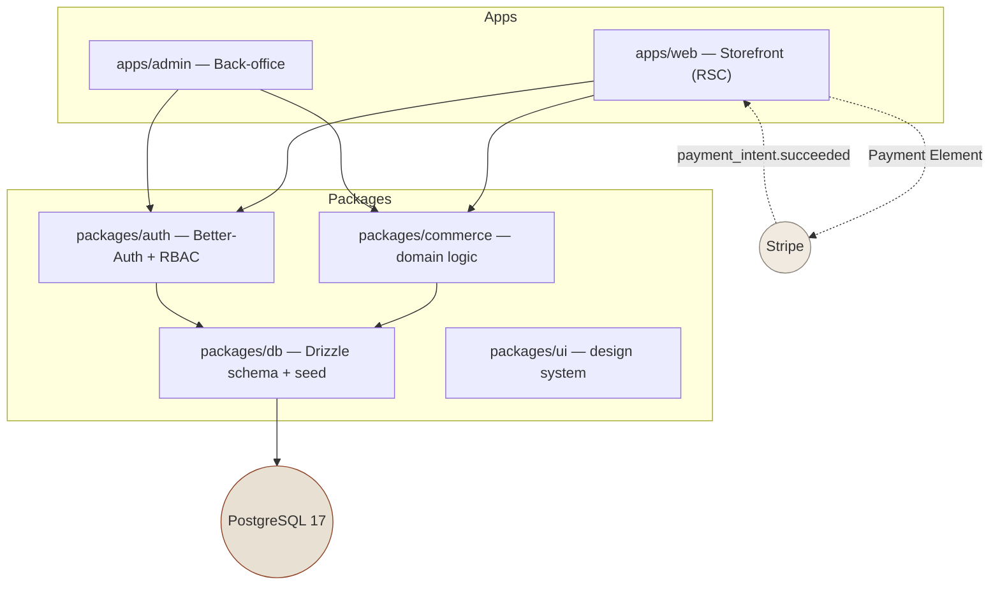

# Scandi Haven

     

**A production-grade, self-hosted e-commerce platform for a Scandinavian furniture, lighting, textiles and ceramics brand — storefront, custom commerce engine, and admin back-office in one Turborepo.**

The static brand site had no checkout, accounts, inventory, or administration. This repository replaces it with a full platform: a Next.js 16 storefront (PLP/PDP/cart/Stripe checkout), a custom commerce engine (inventory reservation, promotions, order state machine, webhook-driven order placement), and an RBAC-gated admin — specified end-to-end in [`PRD.md`](./PRD.md) and implemented here at Phase 0/1 foundations, with every deferred surface stubbed against its PRD requirement ID.

## Features (implemented)

| | Feature | Where |
|---|---|---|
| 🛍️ | Storefront: home, category PLPs with sort/pagination, PDP with variant swatches & lead-time badges | `apps/web` |
| 🛒 | Server-truth cart: signed-cookie identity, guest cart, promo codes, mini-cart drawer | `apps/web` + `packages/commerce` |
| 💳 | Stripe Payment Element checkout; webhook-driven order placement with amount re-verification | `packages/commerce/checkout-service` |
| 📦 | Multi-warehouse inventory with reservation semantics and append-only movement ledger | `packages/db` schema |
| 🔐 | Better-Auth (email/password, admin plugin, DB sessions) + typed RBAC matrix with audit logging | `packages/auth`, `apps/admin` |
| 🧮 | Pure, property-tested domain: integer money, largest-remainder discounts, promotion engine, order state machine | `packages/commerce` |
| 🧪 | Vitest unit/property suites (coverage-gated) + Playwright E2E with axe WCAG 2.2 AA scans | repo-wide, CI |
| 🎨 | Scandi design system: Tailwind v4 `@theme` tokens, Fraunces/Inter, Radix primitives | `packages/ui` |

## Architecture

| Layer | Technology | Version | Purpose |
|---|---|---|---|
| Package manager | pnpm + Turborepo | 10.x / 2.x | Workspace graph, task pipeline |
| Storefront & admin | Next.js (App Router, RSC, Turbopack) | 16.3 | SSR for SEO, Server Actions for mutations |
| UI runtime | React | 19.2 | Server Components by default |
| Language | TypeScript (strict, `noUncheckedIndexedAccess`) | 5.9 | End-to-end types |
| Styling | Tailwind CSS v4 (`@theme`) + PostCSS | 4.3 | CSS-first tokens from `packages/ui` |
| Components | Radix primitives, shadcn-style | current | Accessible primitives, themed via CSS vars |
| Database | PostgreSQL | 17 | Single source of truth |
| ORM | Drizzle ORM + drizzle-kit | 0.45 | Typed schema, forward-only migrations |
| Auth | Better-Auth (DB sessions, admin plugin) | 1.7 | Email/password, RBAC, 2FA-ready |
| Validation | Zod | 4.5 | Every boundary: actions, routes, env |
| Client state | Zustand | 5 | Drawer/UI state only (server is truth) |
| Payments | Stripe (Payment Element, Tax, webhooks) | 22.x | SAQ-A scope — no card data on our servers |
| Email | React Email + Resend | current | Templates as components; log transport in dev |
| Quality | ESLint 9 flat · Vitest · Playwright · axe | current | Lint, unit/property, E2E, a11y gates |



Requests read through RSC → `commerce` queries → Drizzle. Mutations flow through Server Actions (`ActionResult<T>` envelope) with Zod validation, tag revalidation, and outbox jobs for side effects. Order placement happens in the Stripe webhook transaction: totals re-verified, inventory locked with `SELECT … FOR UPDATE`, outbox email jobs emitted.

## File Hierarchy

```
📂 apps
 ├─ 📂 web                  Storefront: routes, Server Actions, cart drawer, checkout
 │  ├─ 📂 e2e               Playwright specs + axe a11y scans
 │  ├─ 📄 proxy.ts          Next 16 proxy: security headers, request IDs
 │  └─ 📂 public/products   Placeholder catalog art (SVG)
 ├─ 📂 admin                Back-office: dashboard, product/order management
 └─ 📄 (each) next.config.ts, proxy.ts, eslint.config.mjs
📂 packages
 ├─ 📂 db                   Drizzle schema (PRD §7), pooled client, idempotent seed
 ├─ 📂 auth                 Better-Auth server/client + RBAC matrix
 ├─ 📂 commerce             money · pricing · promotions · order-state · catalog/cart/checkout services
 ├─ 📂 ui                   tokens.css (@theme) + primitives + composites
 ├─ 📂 email                React Email templates + send adapter
 └─ 📂 config               ESLint factory, tsconfig bases, Zod env parser
📄 PRD.md                   Final spec: FR-100…FR-999, schema, contracts, rollout
📄 docker-compose.yml       PostgreSQL 17 (postgres:17-alpine, service `postgres` → scandihaven_postgres, volume postgres_data, network scandihaven_net)
📄 docker-compose.yml.example  Template — cp to docker-compose.yml
📄 infrastructure/postgres/init/00-create-extensions.sql  pgcrypto + pg_trgm (run on first docker compose up)
📄 turbo.json               Task graph (+ globalEnv manifest)
```

## Quick Start

Prerequisites: **Node.js ≥ 22**, **PNPM 10** (`corepack enable`), **Docker** (or any local PostgreSQL 17).

```bash
pnpm install
docker compose up -d               # PostgreSQL 17 (postgres:17-alpine, service `postgres`; logs: docker compose logs -f postgres)
cp .env.example .env               # then fill secrets (below)
pnpm db:setup                      # schema + demo catalog (migrate && seed)
pnpm dev                           # storefront on http://localhost:3000
```

**Verify setup**

```bash
curl -s localhost:3000/api/health   # {"status":"ok","db":true,...}
pnpm typecheck && pnpm lint && pnpm test   # all green
open http://localhost:3000/shop     # seeded catalog (Halden armchair, Øresund lamp, …)
```

Secrets: `BETTER_AUTH_SECRET` ← `openssl rand -base64 32`; `CRON_SECRET` ← `openssl rand -hex 16`. Stripe test keys come from the Stripe dashboard — without them the checkout shows an explicit "not configured" notice (and the E2E suite asserts that state). Admin user: `SEED_ADMIN_PASSWORD=… pnpm seed:admin` (no default credentials ship in the repo).

## Environment Variables

| Variable | Purpose | Required |
|---|---|---|
| `DATABASE_URL` | PostgreSQL 17 connection string (`scandihaven_dev` / `scandihaven_user` via compose) | ✅ |
| `BETTER_AUTH_SECRET` | Auth signing + cart-cookie HMAC (≥ 32 chars) | ✅ |
| `BETTER_AUTH_URL` / `NEXT_PUBLIC_SITE_URL` | Canonical origin for auth redirects | ✅ |
| `STRIPE_SECRET_KEY` · `STRIPE_WEBHOOK_SECRET` · `NEXT_PUBLIC_STRIPE_PUBLISHABLE_KEY` | Payments (test mode locally) | for checkout |
| `RESEND_API_KEY` · `EMAIL_FROM` | Transactional email (log transport when unset) | optional |
| `CRON_SECRET` | Protects `/api/jobs/run` (outbox drainer) | in prod |
| `AUTH_GOOGLE_*` / `AUTH_APPLE_*` | OAuth providers | optional |

Full manifest with generation commands: [`.env.example`](./.env.example).

## Testing

```bash
pnpm test                # Vitest: pricing/promotions/state-machine/RBAC/schema suites
pnpm e2e                 # Playwright Chromium (needs migrated+seeded DB)
pnpm --filter @scandihaven/web exec playwright test --project=chromium -g "cart"   # single spec
pnpm db:setup                      # fresh container (migrate && seed)
pnpm db:reset && pnpm db:setup     # clean cycle (drop → migrate → seed)
```

- Coverage gates on the pure domain package: **90% lines / 85% functions** (property-based invariants via fast-check).
- E2E includes axe scans (WCAG 2.2 AA): serious/critical violations block.
- Stripe test cards: `4242 4242 4242 4242` · 3-D Secure: `4000 0000 0000 3220`; forward webhooks with `stripe listen --forward-to localhost:3000/api/webhooks/stripe`.

## Design System

Defined once in [`packages/ui/src/tokens.css`](./packages/ui/src/tokens.css) (Tailwind v4 `@theme`):

| Token | Value | Usage |
|---|---|---|
| `--color-bg` / `bg-2` / `bg-3` | `#FAF7F2` / `#F0EAE0` / `#E8E0D2` | Warm off-white surfaces |
| `--color-ink` / `ink-2` / `muted` | `#1F1B17` / `#4A433B` / `#6F665C` | Text (AA-checked on cream) |
| `--color-accent` / `accent-2` | `#C97B5E` / `#8F4326` | Terracotta display accents / AA text & primary buttons |
| `--color-sage` / `wood` | `#8B9A82` / `#C9A876` | Badges, secondary highlights |
| `--radius-card` / `pill` / `image` | 2px / 999px / 0 | Cards / chips / sharp editorial imagery |
| `--ease-brand`, 4 durations | `cubic-bezier(.22,1,.36,1)` | Motion (reduced-motion aware) |

Typography: **Fraunces** (display, via `next/font`) · **Inter** (UI) — self-hosted, no render-blocking font requests.

## Project Status

| Phase | Status | Deliverables |
|---|---|---|
| 0 — Foundations (PRD §13.2) | ✅ Complete | Monorepo, schema+migrations+seed, auth+RBAC, design system, storefront core, admin core, Stripe wiring, CI, test suites |
| 1 — MVP storefront | 🟡 Scaffolded | Full cart/checkout/account flows implemented; facets UI, reviews submission, i18n routing, returns portal pending |
| 2 — Pre-launch polish | ⬜ | Perf/a11y/SEO passes, consent vendor, image CDN |
| 3–4 — Soft launch / launch | ⬜ | Per PRD §13.6 |
| 5 — Post-launch (trade, gift cards, Net-30) | ⬜ | Schema-ready (`payment_terms`, trade tables) |

Deferred surfaces are stubbed in code with their PRD FR IDs — nothing is silently missing (inventory in [`PRD.md` Appendix B](./PRD.md#144-appendix-b--scaffold-inventory-what-exists-in-this-repository-now)).

## Troubleshooting

| Issue | Solution |
|---|---|
| Classes like `bg-secondary` have no CSS | The `@source` directives in each app's `globals.css` must include `packages/ui/src` (Tailwind v4 auto-scan doesn't reach workspace packages) |
| Turbo build "does nothing" / silently skips | You created a workspace dependency cycle (e.g. `db` ↔ `commerce`); package direction must stay `db ← auth ← commerce ← apps` |
| Cart always empty after add | `BETTER_AUTH_SECRET` changed between signing and verifying — the cart cookie HMAC uses it; keep the value stable per environment |
| `next build` type error on page file | Next 16 pages may only export `default` + metadata/revalidate/dynamic — move helpers out |
| Seed refuses to run | Seed/migrate only accept local hosts (`localhost`, `127.0.0.1`) by design |
| `docker compose` volume `pgdata` not found / `scandihaven-db` unhealthy | Renamed to `postgres_data` / `scandihaven_postgres` with `PGDATA` and `start_period`; run `docker compose down -v` once (one-time, re-seeds via `pnpm db:seed`) then `docker compose up -d` (init installs `pgcrypto`+`pg_trgm`) |
| Image optimizer hangs in CI/sandbox | Set `DISABLE_IMAGE_OPTIMIZER=1` (local only — production keeps the optimizing pipeline) |

## Documentation

- [`PRD.md`](./PRD.md) — final build-ready product requirements (v4.0): personas, 90+ requirement IDs with acceptance criteria, DDL-level schema, action/API contracts, provider ports & feature flags (§4.8), SLOs, closed-decisions registry, agent operating contract, rollout plan. `PRD_v3a.md`/`PRD_v3b.md` remain as reviewed proposal inputs.
- [`AGENTS.md`](./AGENTS.md) — high-signal instructions for AI coding agents.
- [`CLAUDE.md`](./CLAUDE.md) — conventions and workflow contract for assistant-driven development.
- [`PRD_draft.md`](./PRD_draft.md) — original draft (stack recommendation superseded; domain scope preserved).

## License

No open-source license yet — all rights reserved by the maintainers until a license is added.
